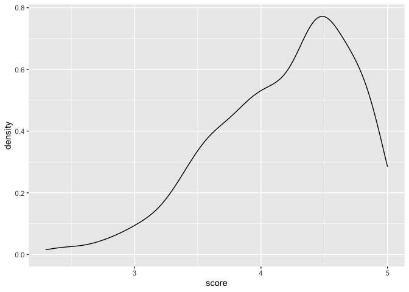
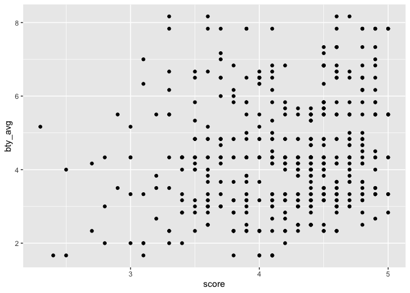
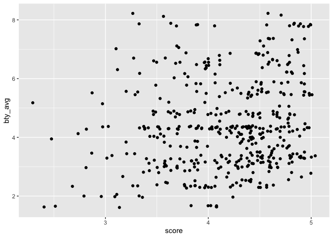
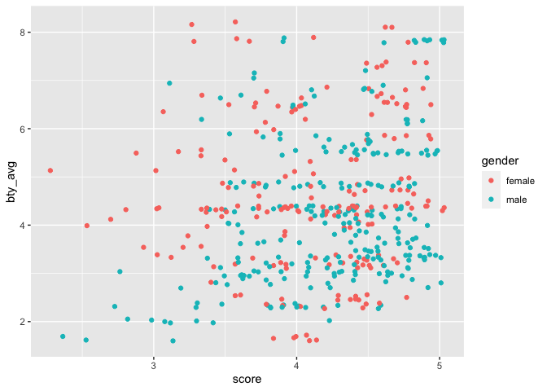
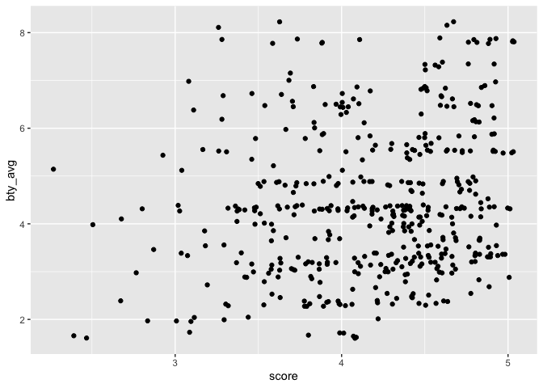
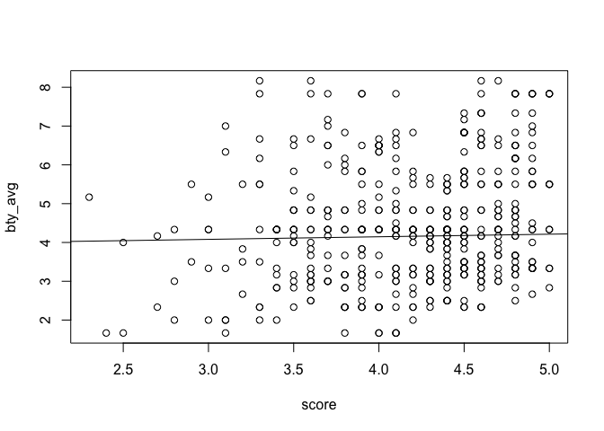
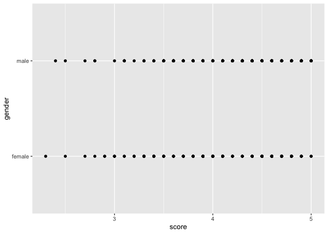
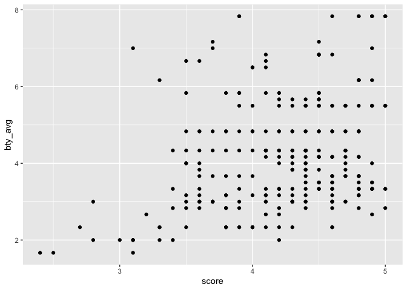
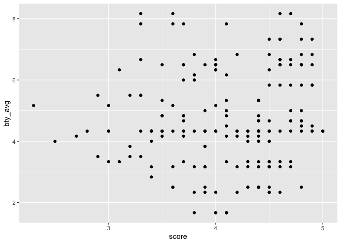

Lab 09v2 - Grading the professor, Pt. 1
================
John Bennett
March 30, 2022

### Load packages and data

``` r
library(tidyverse) 
library(broom)
library(openintro)
```

``` r
?evals
```

### Part 1

``` r
ggplot(evals, aes(x = score)) + geom_density()
```

<!-- -->

Q1. Visualize the distribution of score. Is the distribution skewed?
What does that tell you about how students rate courses? Is this what
you expected to see? Why, or why not? Include any summary statistics and
visualizations you use in your response. A. The distribution is
negatively skewed. This tells me that students rate the majority of
their courses with very high scores. I was expecting to see a normal
distribution because there would be a vast diversity of opinions when it
comes to course evals. However, the positive evals do make sense when
considering that many of the courses will be electives, leading to a
natural tendency for students to at least favor the material covered in
the courses. This could possibly boost impressions of individual
professors.

Q2. Visualize and describe the relationship between score and the
variable bty_avg, a professor’s average beauty rating. Hint: See the
help page for the function at
<http://ggplot2.tidyverse.org/reference/index.html>.

``` r
p <- ggplot(evals, aes(score, bty_avg))
p + geom_point()
```

<!-- -->

Q3. Replot the scatterplot from Exercise 3, but this time use
geom_jitter()? What does “jitter” mean? What was misleading about the
initial scatterplot? A. Jittering adds a small amount of variation to
the data points, so that they do not visually plot on top of each other.
When that happens, two data points would appear as one. So that we can
see our data points, jitter spaces the points out slightly.

``` r
p <- ggplot(evals, aes(score, bty_avg))
p + geom_jitter()
```

<!-- -->

-Testing a different way of fine-tuning the visualization.

``` r
p <- ggplot(evals, aes(score, bty_avg))
p + geom_jitter(aes(colour = gender))
```

<!-- -->

### Part 2

Q4. Let’s see if the apparent trend in the plot is something more than
natural variation. Fit a linear model called m_bty to predict average
professor evaluation score by average beauty rating (bty_avg). Based on
the regression output, write the linear model. A. The code and results
of the linear model are below.

``` r
m_bty.lm <- lm(score ~ bty_avg, data = evals)
summary(m_bty.lm)
```

    ## 
    ## Call:
    ## lm(formula = score ~ bty_avg, data = evals)
    ## 
    ## Residuals:
    ##     Min      1Q  Median      3Q     Max 
    ## -1.9246 -0.3690  0.1420  0.3977  0.9309 
    ## 
    ## Coefficients:
    ##             Estimate Std. Error t value Pr(>|t|)    
    ## (Intercept)  3.88034    0.07614   50.96  < 2e-16 ***
    ## bty_avg      0.06664    0.01629    4.09 5.08e-05 ***
    ## ---
    ## Signif. codes:  0 '***' 0.001 '**' 0.01 '*' 0.05 '.' 0.1 ' ' 1
    ## 
    ## Residual standard error: 0.5348 on 461 degrees of freedom
    ## Multiple R-squared:  0.03502,    Adjusted R-squared:  0.03293 
    ## F-statistic: 16.73 on 1 and 461 DF,  p-value: 5.083e-05

Thus, our linear model (y=b0+b1x) will be y = 3.88 + .066

Q5. Replot your visualization from Exercise 3, and add the regression
line to this plot in orange color. Turn off the shading for the
uncertainty of the line. A. Code for regression line added to
visualization.

``` r
ggplot(evals, aes(score, bty_avg)) + 
geom_jitter() 
```

<!-- -->

``` r
stat_smooth(method = lm) 
```

    ## geom_smooth: se = TRUE, na.rm = FALSE, orientation = NA
    ## stat_smooth: method = function (formula, data, subset, weights, na.action, method = "qr", model = TRUE, x = FALSE, y = FALSE, qr = TRUE, singular.ok = TRUE, contrasts = NULL, offset, ...) 
    ## {
    ##     ret.x <- x
    ##     ret.y <- y
    ##     cl <- match.call()
    ##     mf <- match.call(expand.dots = FALSE)
    ##     m <- match(c("formula", "data", "subset", "weights", "na.action", "offset"), names(mf), 0)
    ##     mf <- mf[c(1, m)]
    ##     mf$drop.unused.levels <- TRUE
    ##     mf[[1]] <- quote(stats::model.frame)
    ##     mf <- eval(mf, parent.frame())
    ##     if (method == "model.frame") 
    ##         return(mf)
    ##     else if (method != "qr") 
    ##         warning(gettextf("method = '%s' is not supported. Using 'qr'", method), domain = NA)
    ##     mt <- attr(mf, "terms")
    ##     y <- model.response(mf, "numeric")
    ##     w <- as.vector(model.weights(mf))
    ##     if (!is.null(w) && !is.numeric(w)) 
    ##         stop("'weights' must be a numeric vector")
    ##     offset <- model.offset(mf)
    ##     mlm <- is.matrix(y)
    ##     ny <- if (mlm) 
    ##         nrow(y)
    ##     else length(y)
    ##     if (!is.null(offset)) {
    ##         if (!mlm) 
    ##             offset <- as.vector(offset)
    ##         if (NROW(offset) != ny) 
    ##             stop(gettextf("number of offsets is %d, should equal %d (number of observations)", NROW(offset), ny), domain = NA)
    ##     }
    ##     if (is.empty.model(mt)) {
    ##         x <- NULL
    ##         z <- list(coefficients = if (mlm) matrix(NA, 0, ncol(y)) else numeric(), residuals = y, fitted.values = 0 * y, weights = w, rank = 0, df.residual = if (!is.null(w)) sum(w != 0) else ny)
    ##         if (!is.null(offset)) {
    ##             z$fitted.values <- offset
    ##             z$residuals <- y - offset
    ##         }
    ##     }
    ##     else {
    ##         x <- model.matrix(mt, mf, contrasts)
    ##         z <- if (is.null(w)) 
    ##             lm.fit(x, y, offset = offset, singular.ok = singular.ok, ...)
    ##         else lm.wfit(x, y, w, offset = offset, singular.ok = singular.ok, ...)
    ##     }
    ##     class(z) <- c(if (mlm) "mlm", "lm")
    ##     z$na.action <- attr(mf, "na.action")
    ##     z$offset <- offset
    ##     z$contrasts <- attr(x, "contrasts")
    ##     z$xlevels <- .getXlevels(mt, mf)
    ##     z$call <- cl
    ##     z$terms <- mt
    ##     if (model) 
    ##         z$model <- mf
    ##     if (ret.x) 
    ##         z$x <- x
    ##     if (ret.y) 
    ##         z$y <- y
    ##     if (!qr) 
    ##         z$qr <- NULL
    ##     z
    ## }, formula = NULL, se = TRUE, n = 80, fullrange = FALSE, level = 0.95, na.rm = FALSE, orientation = NA, method.args = list(), span = 0.75
    ## position_identity

``` r
reg1 <- lm(score~bty_avg,data=evals) 
    summary(reg1)
```

    ## 
    ## Call:
    ## lm(formula = score ~ bty_avg, data = evals)
    ## 
    ## Residuals:
    ##     Min      1Q  Median      3Q     Max 
    ## -1.9246 -0.3690  0.1420  0.3977  0.9309 
    ## 
    ## Coefficients:
    ##             Estimate Std. Error t value Pr(>|t|)    
    ## (Intercept)  3.88034    0.07614   50.96  < 2e-16 ***
    ## bty_avg      0.06664    0.01629    4.09 5.08e-05 ***
    ## ---
    ## Signif. codes:  0 '***' 0.001 '**' 0.01 '*' 0.05 '.' 0.1 ' ' 1
    ## 
    ## Residual standard error: 0.5348 on 461 degrees of freedom
    ## Multiple R-squared:  0.03502,    Adjusted R-squared:  0.03293 
    ## F-statistic: 16.73 on 1 and 461 DF,  p-value: 5.083e-05

``` r
with(evals,plot(score, bty_avg))
    abline(reg1)
```

<!-- -->

Q6. Interpret the slope of the linear model in context of the data. A.
The slope (.066) is an effect size representing the degree to which eval
scores are associated with (i.e., can predict) average beauty rating.

Q7. Interpret the intercept of the linear model in context of the data.
Comment on whether or not the intercept makes sense in this context. A.
The intercept (3.88) is the predicted eval score for an individual with
a “0” on average beauty rating. On initial impression, this intercept
does not make sense to me, in this context. An individual with a “0” on
beauty rating does not seem to have a place in the visual plot. After
looking at the plot further, it makes sense that a person with a “0” on
beauty rating would have an eval score in the middle of the plot. If
there is a weak relationship between our variables, then the predictor
variable simply predicts “something in the middle”.

Q8. Determine the R2 of the model and interpret it in context of the
data. A. In the context of this data, and probably most data, an R2 of
.033 can be considered very low. Here, (.033) or 3 percent is the
proportion of variance in eval scores that is accounted for by beauty
rating. The R2 (.033) is an effect size representing the degree to which
individuals’ beauty ratings are associated with (i.e., can predict)
their eval scores.

### Part 3

Q9. Fit a new linear model called m_gen to predict average professor
evaluation score based on gender of the professor. Based on the
regression output, write the linear model and interpret the slope and
intercept in context of the data. A. Our linear model (y=b0+b1x) will be
y = 4.1 + .14 -The slope (.14) is an effect size representing the degree
to which gender is associated with (i.e., can predict) eval score. -The
intercept (4.1) is the predicted eval score for an individual with a “0”
on gender.

``` r
p <- ggplot(evals, aes(score, gender))
p + geom_point()
```

<!-- -->

``` r
mgen.lm <- lm(score ~ gender, data = evals)
summary(mgen.lm)
```

    ## 
    ## Call:
    ## lm(formula = score ~ gender, data = evals)
    ## 
    ## Residuals:
    ##      Min       1Q   Median       3Q      Max 
    ## -1.83433 -0.36357  0.06567  0.40718  0.90718 
    ## 
    ## Coefficients:
    ##             Estimate Std. Error t value Pr(>|t|)    
    ## (Intercept)  4.09282    0.03867 105.852  < 2e-16 ***
    ## gendermale   0.14151    0.05082   2.784  0.00558 ** 
    ## ---
    ## Signif. codes:  0 '***' 0.001 '**' 0.01 '*' 0.05 '.' 0.1 ' ' 1
    ## 
    ## Residual standard error: 0.5399 on 461 degrees of freedom
    ## Multiple R-squared:  0.01654,    Adjusted R-squared:  0.01441 
    ## F-statistic: 7.753 on 1 and 461 DF,  p-value: 0.005583

Q10.1. What is the equation of the line corresponding to male
professors? Our linear model will be y = 3.7 + .11

``` r
male_data <- evals %>%
filter(gender == "male")
```

``` r
p <- ggplot(male_data, aes(score, bty_avg))
p + geom_point()
```

<!-- -->

``` r
male.lm <- lm(score ~ bty_avg, data = male_data)
summary(male.lm)
```

    ## 
    ## Call:
    ## lm(formula = score ~ bty_avg, data = male_data)
    ## 
    ## Residuals:
    ##      Min       1Q   Median       3Q      Max 
    ## -1.55036 -0.35095  0.08727  0.36270  0.92108 
    ## 
    ## Coefficients:
    ##             Estimate Std. Error t value Pr(>|t|)    
    ## (Intercept)  3.76655    0.09278  40.598  < 2e-16 ***
    ## bty_avg      0.11026    0.02066   5.336 2.04e-07 ***
    ## ---
    ## Signif. codes:  0 '***' 0.001 '**' 0.01 '*' 0.05 '.' 0.1 ' ' 1
    ## 
    ## Residual standard error: 0.497 on 266 degrees of freedom
    ## Multiple R-squared:  0.09668,    Adjusted R-squared:  0.09329 
    ## F-statistic: 28.47 on 1 and 266 DF,  p-value: 2.038e-07

Q10.2. What is the equation of the line corresponding to female
professors? Our linear model will be y = 3.95 + .03

``` r
female_data <- evals %>%
filter(gender == "female")
```

``` r
p <- ggplot(female_data, aes(score, bty_avg))
p + geom_point()
```

<!-- -->

``` r
female.lm <- lm(score ~ bty_avg, data = female_data)
summary(female.lm)
```

    ## 
    ## Call:
    ## lm(formula = score ~ bty_avg, data = female_data)
    ## 
    ## Residuals:
    ##      Min       1Q   Median       3Q      Max 
    ## -1.80839 -0.39561  0.09886  0.44565  0.91717 
    ## 
    ## Coefficients:
    ##             Estimate Std. Error t value Pr(>|t|)    
    ## (Intercept)  3.95006    0.12639  31.254   <2e-16 ***
    ## bty_avg      0.03064    0.02571   1.192    0.235    
    ## ---
    ## Signif. codes:  0 '***' 0.001 '**' 0.01 '*' 0.05 '.' 0.1 ' ' 1
    ## 
    ## Residual standard error: 0.5632 on 193 degrees of freedom
    ## Multiple R-squared:  0.007307,   Adjusted R-squared:  0.002163 
    ## F-statistic: 1.421 on 1 and 193 DF,  p-value: 0.2348

Q11. Fit a new linear model called m_rank to predict average professor
evaluation score based on rank of the professor. Based on the regression
output, write the linear model and interpret the slopes and intercept in
context of the data. A. Our linear model for tenure track is y = 4.3 -
.13 -The slope (-.13) is an effect size representing the degree to which
tenure track status is associated with (i.e., can predict) eval score.
-The intercept (4.3) is the predicted eval score for an individual with
a “0” on tenure track.

``` r
m_rank.lm <- lm(score ~ rank, data = evals)
summary(m_rank.lm)
```

    ## 
    ## Call:
    ## lm(formula = score ~ rank, data = evals)
    ## 
    ## Residuals:
    ##     Min      1Q  Median      3Q     Max 
    ## -1.8546 -0.3391  0.1157  0.4305  0.8609 
    ## 
    ## Coefficients:
    ##                  Estimate Std. Error t value Pr(>|t|)    
    ## (Intercept)       4.28431    0.05365  79.853   <2e-16 ***
    ## ranktenure track -0.12968    0.07482  -1.733   0.0837 .  
    ## ranktenured      -0.14518    0.06355  -2.284   0.0228 *  
    ## ---
    ## Signif. codes:  0 '***' 0.001 '**' 0.01 '*' 0.05 '.' 0.1 ' ' 1
    ## 
    ## Residual standard error: 0.5419 on 460 degrees of freedom
    ## Multiple R-squared:  0.01163,    Adjusted R-squared:  0.007332 
    ## F-statistic: 2.706 on 2 and 460 DF,  p-value: 0.06786

Q12. Create a new variable called rank_relevel where “tenure track” is
the baseline level.

``` r
rank_relevel <- evals %>%
filter(rank == "tenure track")
```

Q13. Fit a new linear model called m_rank_relevel to predict average
professor evaluation score based on rank_relevel of the professor. This
is the new (releveled) variable you created in Exercise 13. Based on the
regression output, write the linear model and interpret the slopes and
intercept in context of the data. Also determine and interpret the R2 of
the model.

\`\`{r RankLevelLinearmodel} m_rank_relevel.lm \<- lm(score \~ rank,
data = rank_relevel) summary(m_rank_relevel.lm)


    [Note 1: the command above gave me an error message halting execution, so I've removed this from the Knit.
    Note 2: I've ended up with only one faculty rank at this stage, which prevents a comparison of groups...]

Q14. Create another new variable called tenure_eligible that labels
“teaching” faculty as “no” and labels “tenure track” and “tenured”
faculty as “yes”.

Create new variable row out of old variable

``` r
evals$NewVar <- evals$rank
```

\[Note: I know I needed to do the above command, so I feel good about
that. However, the next step requires either filter or rename\]

\`\`{r NewVarandRename} evals \<- rename(evals, c(teaching=“no”, tenure
track= “yes”, “tenured”= “yes”))


    [Note 1: the command above gave me an error message halting execution, so I've removed this from the Knit.]

Q15. Fit a new linear model called m_tenure_eligible to predict average
professor evaluation score based on tenure_eligibleness of the
professor. This is the new (regrouped) variable you created in Exercise
15. Based on the regression output, write the linear model and interpret
the slopes and intercept in context of the data. Also determine and
interpret the R2 of the model.

\[Note: As abobe, because I’ve ended up with only one rank at this
stage, this prevents a comparison of groups…\]
